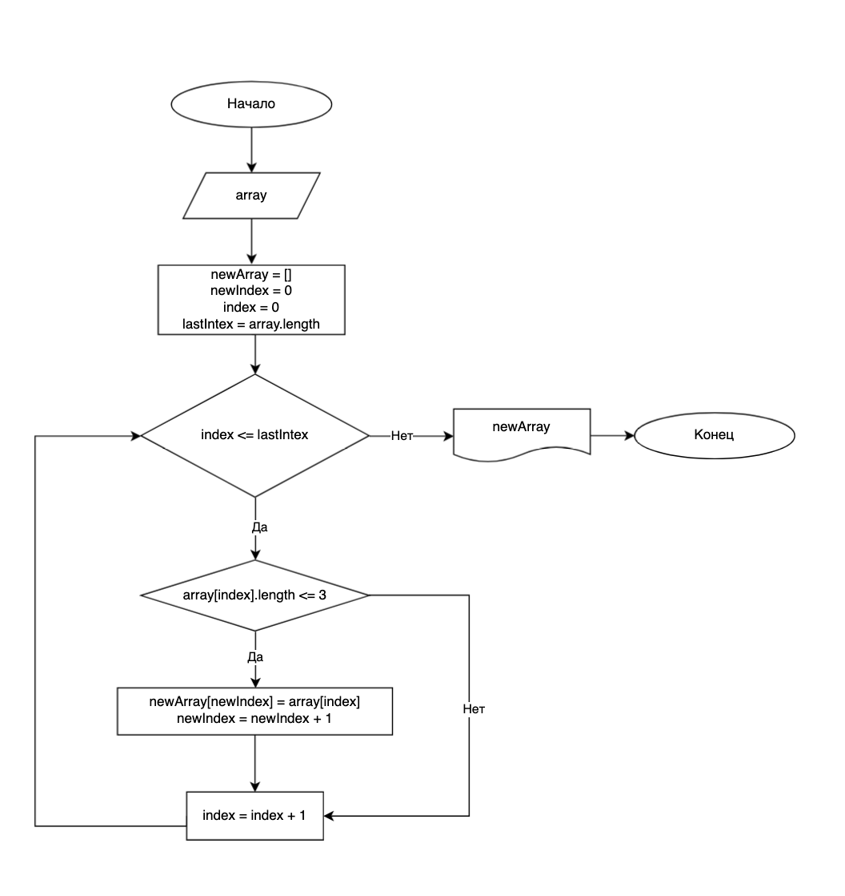

# Итоговая работа

## Задача
Написать программу, которая из имеющегося массива строк формирует новый массив из строк, длина которых меньше, либо равна 3 символам. Первоначальный массив можно ввести с клавиатуры, либо задать на старте выполнения алгоритма. При решении не рекомендуется пользоваться коллекциями, лучше обойтись исключительно массивами.

## Блок-схема


## Исходный код
```cs
string[] array =  ["Hello", "2", "world", ":-)"];
int newArraySize = 0;

for (int i = 0; i < array.Length; i++)
{
    if (array[i].Length <= 3)
    {
        newArraySize++;
    }
}

int newIndex = 0;
string[] newArray = new string[newArraySize];

for (int i = 0; i < array.Length; i++)
{
    if (array[i].Length <= 3)
    {
        newArray[newIndex] = array[i];
        newIndex++;
    }
}

System.Console.WriteLine("[" + string.Join(',', newArray) + "]");
```

## Алгоритм

1. Инициализировать исходный массив;
2. Инициализироать переменную, отвечающую за опеределение длины нового массива;
3. Перебрать исходный массив,чтобы получить размер нового массива;
4. Инициализировать новый массив с полученной длиной;
5. Инициализировать переменную, отвечающую за индекс нового массива;
6. Перебрать исходный массив и на основании условия заполнять новый массив, увеличивая переменную (п.5) на 1;
7. Вывод нового массива.
